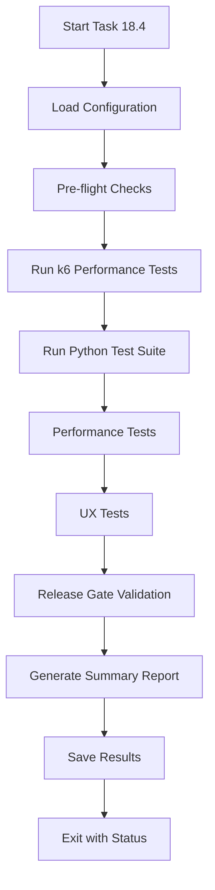

# Task 18.4: Performance and UX Verification Tests

This document describes the comprehensive test suite for Task 18.4, which validates Requirements 11.34-11.40 covering performance and UX verification.

## Overview

Task 18.4 implements the final validation phase of the Reddit Ghost Publisher MVP system, focusing on:

- **Performance Testing**: API response times, E2E processing, and throughput stability
- **UX Testing**: Template consistency, tag formatting, and image fallback behavior  
- **Release Gate Validation**: Overall system readiness across functionality, quality, performance, and operations

## Requirements Coverage

### Requirement 11.34: API p95 Performance Testing
- **Target**: p95 response time ≤ 300ms
- **Alert Threshold**: p95 response time < 400ms  
- **Error Rate**: < 5%
- **Test Method**: k6 load testing with 100 RPS sustained load
- **Implementation**: `tests/k6/task-18-4-performance-test.js`

### Requirement 11.35: E2E Processing Time Testing
- **Target**: Each post processes from collection to publishing in ≤ 5 minutes
- **Test Method**: Process 10 posts end-to-end and measure timing
- **Implementation**: `PerformanceUXVerifier.test_e2e_processing_time()`

### Requirement 11.36: Throughput Stability Testing  
- **Target**: 100 posts/hour processing with <5% failure rate
- **Retry Recovery**: Failed posts should recover through retry mechanism
- **Test Method**: Simulate 1-hour workload with failure injection
- **Implementation**: `PerformanceUXVerifier.test_throughput_stability()`

### Requirement 11.37: Article Template Consistency Testing
- **Target**: 5 random posts maintain consistent section order and styling
- **Required Sections**: Title, Summary, Key Insights, Original Link, Source Attribution
- **Test Method**: Publish posts and verify template structure
- **Implementation**: `PerformanceUXVerifier.test_article_template_consistency()`

### Requirement 11.38: Tag Limits and Formatting Testing
- **Target**: Recent 20 posts have 3-5 tags with consistent formatting
- **Formatting Rules**: Korean characters or lowercase, consistent spacing
- **Test Method**: Process posts and validate tag compliance
- **Implementation**: `PerformanceUXVerifier.test_tag_limits_and_formatting()`

### Requirement 11.39: Image Fallback Testing
- **Target**: Posts without media use default OG image
- **Test Method**: Publish text-only post and verify fallback image
- **Implementation**: `PerformanceUXVerifier.test_image_fallback()`

### Requirement 11.40: Final Release Gate Criteria
- **Functionality Gate**: Core endpoints operational (Req 1-10)
- **Quality Gate**: Unit coverage ≥ 70%, Postman smoke tests 100% pass
- **Performance Gate**: p95 ≤ 300ms, E2E ≤ 5min, failure rate < 5%
- **Operations Gate**: Slack alerts configured, backup/restore working
- **Implementation**: `PerformanceUXVerifier.test_final_release_gate_criteria()`

## Test Architecture

### Components

1. **Test Runner**: `run_task_18_4_tests.py`
   - Main orchestration and reporting
   - Configuration management
   - Result aggregation

2. **Performance Verifier**: `PerformanceUXVerifier` class
   - Individual test method implementations
   - Result logging and validation
   - API interaction handling

3. **k6 Performance Tests**: `task-18-4-performance-test.js`
   - Load testing for API p95 requirements
   - Custom metrics and thresholds
   - Detailed performance analysis

4. **Configuration**: `test_config_18_4.py`
   - Test parameters and thresholds
   - Environment configuration
   - Requirement mappings

5. **Shell Runner**: `run-task-18-4-performance-tests.sh`
   - k6 test execution wrapper
   - Environment setup and validation
   - Results analysis and reporting

### Test Flow



## Usage

### Quick Start

```bash
# Run all Task 18.4 tests
python tests/verification/run_task_18_4_tests.py

# Run with custom configuration
python tests/verification/run_task_18_4_tests.py --config custom_config.json

# Run only k6 performance tests
./tests/k6/run-task-18-4-performance-tests.sh

# Run against staging environment
BASE_URL=http://staging.example.com:8000 python tests/verification/run_task_18_4_tests.py
```

### Configuration Options

#### Environment Variables

```bash
# API Configuration
export TEST_API_BASE_URL="http://localhost:8000"
export TEST_GHOST_STAGING_URL="https://staging.example.ghost.io"
export TEST_SLACK_WEBHOOK_URL="https://hooks.slack.com/services/..."

# Performance Thresholds
export PERF_API_P95_TARGET_MS="300"
export PERF_API_P95_ALERT_MS="400"
export PERF_K6_MAX_USERS="100"

# Test Parameters
export UX_TEMPLATE_TEST_POSTS="5"
export UX_TAG_TEST_POSTS="20"
export GATE_COVERAGE_THRESHOLD="0.70"
```

#### Custom Configuration File

```json
{
  "performance": {
    "api_p95_target_ms": 250,
    "k6_max_users": 150,
    "e2e_test_posts": 15
  },
  "ux": {
    "template_test_posts": 10,
    "tag_test_posts": 30
  },
  "environment": {
    "api_base_url": "http://staging.example.com:8000"
  }
}
```

### Command Line Options

```bash
# Main test runner options
python tests/verification/run_task_18_4_tests.py \
  --config custom_config.json \
  --output results_18_4.json

# k6 performance test options  
./tests/k6/run-task-18-4-performance-tests.sh \
  --url http://staging.example.com:8000 \
  --p95-target 250 \
  --alert-threshold 350
```

## Expected Results

### Success Criteria

All tests must pass for Task 18.4 to be considered successful:

1. **API p95 Performance**: ≤ 300ms with < 5% error rate
2. **E2E Processing**: Average ≤ 5 minutes per post
3. **Throughput Stability**: < 5% failure rate with retry recovery
4. **Template Consistency**: 100% compliance across test posts
5. **Tag Formatting**: 100% compliance with 3-5 tag limit and formatting rules
6. **Image Fallback**: Default OG image applied when no media present
7. **Release Gate**: All four gates (functionality, quality, performance, operations) pass

### Output Format

#### Console Output
```
================================================================================
TASK 18.4: PERFORMANCE AND UX VERIFICATION TESTS
================================================================================

============================================================
Running 11.34: API p95 Performance
============================================================
  PASS: API p95 Performance Test - p95 duration: 285.50ms (target: ≤300ms, alert: <400ms)

============================================================
Running 11.35: E2E Processing Time
============================================================
  PASS: E2E Processing Time Test - Average processing time: 245.30s (target: ≤300s), 10/10 posts within limit

[... additional test results ...]

================================================================================
TASK 18.4: PERFORMANCE AND UX VERIFICATION TEST RESULTS
================================================================================
Task: 18.4 성능 및 UX 검증 테스트 실행
Duration: 425.67 seconds
Completed: 2024-01-15T10:30:45.123456

Test Results:
  Total Tests: 7
  Passed: 7 (100.0%)
  Failed: 0

Detailed Results:
  ✓ 11.34: API p95 Performance Testing
  ✓ 11.35: E2E Processing Time Testing
  ✓ 11.36: Throughput Stability Testing
  ✓ 11.37: Article Template Consistency Testing
  ✓ 11.38: Tag Limits and Formatting Testing
  ✓ 11.39: Image Fallback Testing
  ✓ 11.40: Final Release Gate Criteria

Performance Metrics:
  api_p95: {'p95_duration_ms': 285.5, 'meets_requirement': True, 'below_alert_threshold': True}
  e2e_processing: {'average_time_seconds': 245.3, 'posts_within_limit': 10, 'success_rate': 1.0}
  throughput_stability: {'failure_rate': 0.02, 'meets_failure_requirement': True}

================================================================================
✓ OVERALL RESULT: ALL PERFORMANCE AND UX TESTS PASSED
The system meets all performance and UX requirements for Task 18.4
================================================================================
```

#### JSON Results File
```json
{
  "execution_info": {
    "start_time": "2024-01-15T10:23:18.456789",
    "end_time": "2024-01-15T10:30:45.123456",
    "duration_seconds": 425.67,
    "task": "18.4 성능 및 UX 검증 테스트 실행"
  },
  "test_summary": {
    "total_tests": 7,
    "passed_tests": 7,
    "failed_tests": 0,
    "success_rate": 100.0
  },
  "requirement_results": {
    "11.34": {
      "name": "API p95 Performance Testing",
      "passed": true,
      "timestamp": "2024-01-15T10:25:30.123456"
    }
  },
  "performance_metrics": {
    "api_p95": {
      "p95_duration_ms": 285.5,
      "meets_requirement": true,
      "below_alert_threshold": true,
      "total_requests": 15420
    }
  },
  "detailed_results": [...]
}
```

## Troubleshooting

### Common Issues

#### k6 Performance Test Failures
```bash
# Check k6 installation
k6 version

# Verify API accessibility
curl -f http://localhost:8000/health

# Run with verbose output
K6_LOG_LEVEL=debug ./tests/k6/run-task-18-4-performance-tests.sh
```

#### API Connection Issues
```bash
# Check if services are running
docker-compose ps

# Verify API endpoints
curl http://localhost:8000/health
curl http://localhost:8000/metrics
```

#### Performance Threshold Failures
- Check system resources (CPU, memory, disk I/O)
- Verify database connection pool settings
- Review Redis configuration and memory usage
- Check for external API rate limiting

#### Template/UX Test Failures
- Verify Ghost CMS staging environment accessibility
- Check template configuration and default OG image URL
- Review tag extraction LLM prompts and responses

### Debug Mode

```bash
# Enable debug logging
export TEST_LOG_LEVEL=DEBUG
python tests/verification/run_task_18_4_tests.py

# Save detailed results
python tests/verification/run_task_18_4_tests.py --output debug_results.json
```

### Performance Tuning

If performance tests fail, consider:

1. **Database Optimization**
   - Add missing indexes
   - Optimize query patterns
   - Tune connection pool size

2. **API Optimization**
   - Enable response caching
   - Optimize serialization
   - Review middleware stack

3. **Infrastructure Scaling**
   - Increase worker processes
   - Add Redis memory
   - Optimize Docker resource limits

## Integration with CI/CD

### GitHub Actions Integration

```yaml
name: Task 18.4 Performance and UX Tests

on:
  push:
    branches: [main]
  pull_request:
    branches: [main]

jobs:
  performance-ux-tests:
    runs-on: ubuntu-latest
    
    services:
      postgres:
        image: postgres:15
        env:
          POSTGRES_PASSWORD: test
        options: >-
          --health-cmd pg_isready
          --health-interval 10s
          --health-timeout 5s
          --health-retries 5
      
      redis:
        image: redis:7
        options: >-
          --health-cmd "redis-cli ping"
          --health-interval 10s
          --health-timeout 5s
          --health-retries 5
    
    steps:
    - uses: actions/checkout@v3
    
    - name: Set up Python
      uses: actions/setup-python@v4
      with:
        python-version: '3.12'
    
    - name: Install k6
      run: |
        sudo apt-key adv --keyserver hkp://keyserver.ubuntu.com:80 --recv-keys C5AD17C747E3415A3642D57D77C6C491D6AC1D69
        echo "deb https://dl.k6.io/deb stable main" | sudo tee /etc/apt/sources.list.d/k6.list
        sudo apt-get update
        sudo apt-get install k6
    
    - name: Install dependencies
      run: |
        pip install -r requirements.txt
        pip install -r requirements-dev.txt
    
    - name: Start application
      run: |
        docker-compose up -d
        sleep 30
    
    - name: Run Task 18.4 Performance and UX Tests
      run: |
        python tests/verification/run_task_18_4_tests.py --output task_18_4_results.json
    
    - name: Upload test results
      uses: actions/upload-artifact@v3
      if: always()
      with:
        name: task-18-4-results
        path: task_18_4_results.json
```

## Maintenance

### Regular Updates

1. **Performance Thresholds**: Review and adjust based on production metrics
2. **Test Data**: Update test subreddits and sample data periodically  
3. **Configuration**: Sync test configuration with production settings
4. **Dependencies**: Keep k6 and testing libraries updated

### Monitoring

- Track test execution times and success rates
- Monitor performance trends over time
- Alert on consistent test failures
- Review and update test coverage regularly

## Related Documentation

- [Task 18.3 System Quality Tests](README_TASK_18_3.md)
- [Overall Verification Strategy](README.md)
- [k6 Performance Testing Guide](../k6/README.md)
- [System Requirements](../../.kiro/specs/reddit-ghost-publisher/requirements.md)
- [System Design](../../.kiro/specs/reddit-ghost-publisher/design.md)